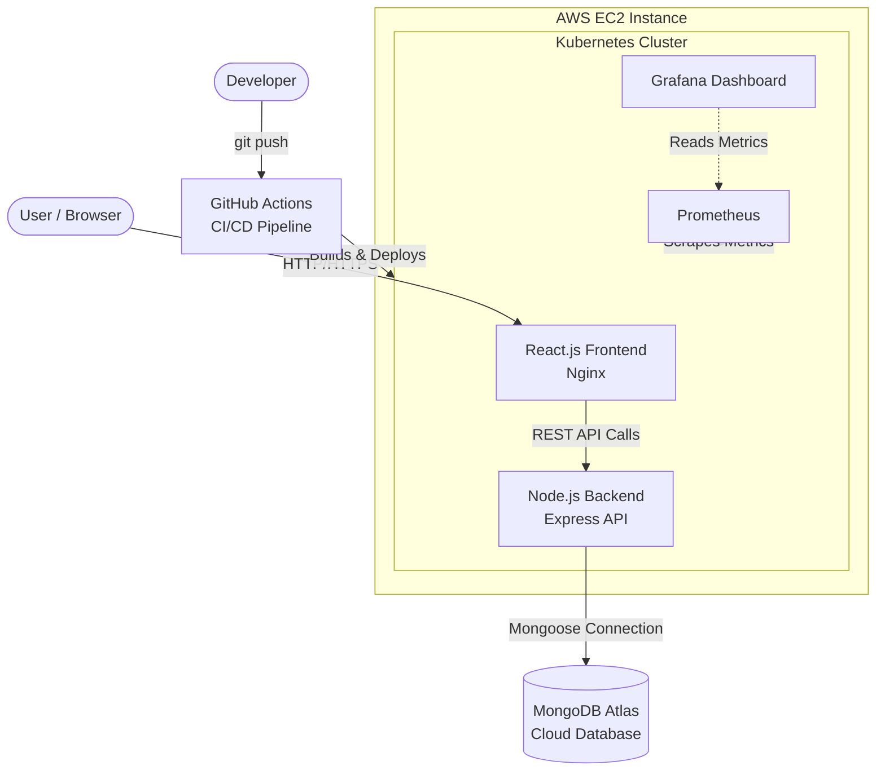

# 🎓 University Application Status Tracker

> A comprehensive full-stack web application designed to help students securely organize, manage, and track their higher education applications across multiple universities.

---

## 📖 Project Overview

Applying to multiple universities often involves juggling varying deadlines, portals, and statuses. This platform provides a centralized, secure dashboard to monitor where your applications stand. Built from the ground up using the MERN stack, it features a modern, responsive user interface, robust stateless session management, and is deployed on AWS using modern DevOps practices.

### 🧰 Technology Stack

#### Frontend
<p align="left">
  <a href="https://skillicons.dev">
    
  </a>
</p>

* **Framework:** React.js
* **Styling:** Tailwind CSS
* **Routing:** React Router DOM
* **API Integration:** Axios

#### Backend & Database
<p align="left">
  <a href="https://skillicons.dev">
    
  </a>
</p>

* **Runtime:** Node.js
* **Framework:** Express.js
* **Database:** MongoDB (Atlas)
* **Authentication:** JSON Web Tokens (JWT) & Bcrypt

#### DevOps & Cloud Architecture
<p align="left">
  <a href="https://skillicons.dev">
    
  </a>
</p>

* **Cloud Provider:** AWS (EC2)
* **Containerization:** Docker
* **Orchestration:** Kubernetes
* **CI/CD:** GitHub Actions
* **Monitoring:** Prometheus & Grafana

---

## 🏛️ Project Architecture



---

## ✨ Key Features

* 🔐 **Secure Authentication:** Full sign-up and login flows using Bcrypt password hashing and stateless JWT session management.
* 📊 **Interactive Dashboard:** A clean, centralized view to instantly check which applications are Pending, Accepted, Rejected, or Waitlisted.
* 📝 **Application Management:** Complete CRUD (Create, Read, Update, Delete) functionality. Add new universities, update statuses, and log application deadlines.
* 🚀 **Cloud-Native Deployment:** Fully containerized backend and frontend deployed on AWS EC2, orchestrated with Kubernetes for high availability and seamless scaling.
* 📈 **Real-Time Monitoring:** Integrated Prometheus and Grafana for continuous visualization of system resource utilization and application metrics.

---

## 📡 Core API Endpoints

| Module | Endpoint | Method | Description |
| :--- | :--- | :---: | :--- |
| **Auth** | `/api/auth/register` | `POST` | Registers a new user |
| **Auth** | `/api/auth/login` | `POST` | Authenticates user & returns JWT |
| **Tracker** | `/api/applications` | `GET` | Fetches all applications for the logged-in user |
| **Tracker** | `/api/applications` | `POST` | Creates a new application entry |
| **Tracker** | `/api/applications/{id}` | `PUT` | Updates an existing application's status/details |
| **Tracker** | `/api/applications/{id}` | `DELETE`| Removes an application from the database |

---

## 💻 Getting Started (Local Development)

### Prerequisites
* Node.js (v18+)
* MongoDB Atlas Account (or local MongoDB server)
* Git
* Docker (optional, for containerized running)

### Setup Instructions

1. **Clone the repository:**
   ```bash
   git clone https://github.com/shravyashetty04/University-Application-Status-Tracker.git
   cd University-Application-Status-Tracker
   ```

2. **Install Dependencies:**
   ```bash
   # Install Backend Dependencies
   cd backend
   npm install

   # Install Frontend Dependencies
   cd ../frontend
   npm install
   ```

3. **Environment Variables:**
   Create a `.env` file in the `backend` directory and add your MongoDB URI and JWT Secret:
   ```env
   PORT=5000
   MONGO_URI=your_mongodb_connection_string
   JWT_SECRET=your_super_secret_key
   ```

4. **Run the Application:**
   ```bash
   # Run Backend
   cd backend
   npm run dev

   # Run Frontend (in a new terminal)
   cd frontend
   npm run dev
   ```

## ☁️ Live Demo & Deployment

The application is deployed live on AWS at: http://ec2-13-61-144-78.eu-north-1.compute.amazonaws.com:8080

The CI/CD pipeline is handled by GitHub actions, which automatically builds the Docker images and deploys the updates to the Kubernetes cluster running on the AWS EC2 instance.
